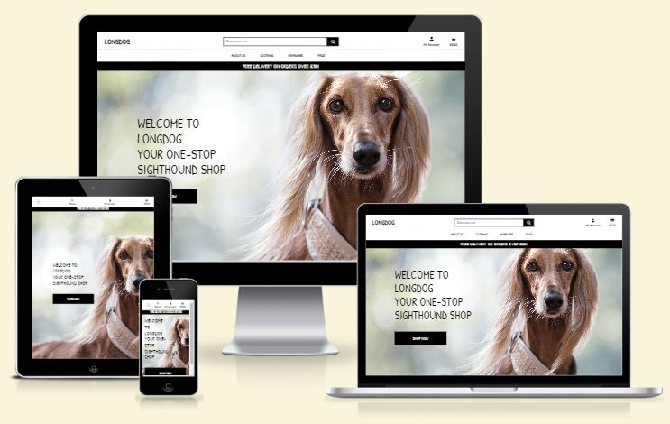
# Longdog
Longdog is my submission for Milestone Project 4.Longdog is an e-commerce site dedicated to the needs of Sighthound owners and their dogs. The site will sell clothing, toys and accessories, in fact anything a Longdog might require!
The basic features of browsing the content and making a purchase can be carried out without registering, however the user is encouraged to register in order to make future ordering simpler and they will also be able to contribute to the site by leaving feedback in the form of product reviews.

## Table Of Contents:
1. [Design & Planning](#design-&-planning)
    * [User Stories](#user-stories)
    * [Wireframes](#wireframes)
    * [Typography](#typography)
    * [Colour Scheme](#colour-scheme)
    * [Database Diagram](#database-diagram)
    
2. [Features](#features)
    * [Header](#top-header)
    * [Navigation](#Navigation-bar)
    * [Home page](#home-page)
    * [About Us page](#about-us-page)
    * [Products page](#products-page)
    * [Product Detail page](#product-detail-page)
    * [Shopping Bag page](#shopping-bag-page)
    * [Checkout page](#checkout-page)
    * [Profile page](#profile-page)
    * [FAQs Page](#faqs-page)
    * [Sign Up Page](#sign-up-page)
    * [CRUD](#crud)
   
   

3. [Technologies Used](#technologies-used)
4. [Libraries](#libraries-used)
5. [Testing](#testing)
6. [Bugs](#bugs)
7. [Deployment](#deployment)
8. [Credits](#credits)
9. [Acknowledgment](#acknowledgment)

## Design & Planning:

### User Stories
- #### First Time Visitor Goals

    1. As a First Time Visitor, I want to easily understand the purpose of the site and be able to navigate to the areas I want to use.
    2. As a First Time Visitor, I want to learn about the company and its values.
    3. As a First Time Visitor, I want to be able to view the products on offer.
    4. As a First Time Visitor, I want to be able to assess the quality and prices of the products on offer.
    5. As a First Time Visitor, I want to register.
    6. As a First Time Visitor, I want to add an item to my basket.
    7. As a First Time Visitor, I want to view/amend/delete the contents of my basket.
    8. As a First Time Visitor, I want to checkout my basket.

- #### Returning Visitor Goals

    1. As a Returning Visitor, I want to log in and view my profile and past purchases.
    2. As a Returning Visitor, I want to make a new or repeat purchase.

- #### Frequent Visitor Goals

    1. As a Frequent Visitor, I want to log in and view my profile and past purchases.
    2. As a Frequent Visitor, I want to make a new or repeat purchase.

### Wireframes
  - Home Page Wireframe - [View](media/wireframes/home.png)
  - About Us Page Wireframe - [View](media/wireframes/about_us.png)
  - Products Page Wireframe - [View](media/wireframes/products.png)
  - Product Detail Page Wireframe - [View](media/wireframes/product_detail.png)
  - FAQs Page Wireframe - [View](media/wireframes/faqs.png)
  - Shopping Bag Page Wireframe - [View](media/wireframes/bag.png)
  - Checkout Page Wireframe - [View](media/wireframes/checkout.png)
  - Profile Page Wireframe - [View](media/wireframes/profile.png)

### Typography
The font I have used for the majority of my site is Patrick Hand SC from [Google Fonts](https://fonts.google.com/specimen/Patrick+Hand+SC). I choose this font because it has an informal, handwritten style whilst still being easy to read.
### Colour Scheme
I have stuck to a very simplistic black and white colour scheme. The pops of colour come from the products and the hero images on the Home, About Us and FAQs pages. The site could easily be adapted in the future to reflect a specific branding but I like the elegant, uncluttered feel it has currently.
### DataBase Diagram
Image of the database diagram for your project

## Features:
- ### Top Header
  The top of my site has the Longdog brand name top left. The search bar is situated in the middle of the screen in a prominent position. The 'My Account' and 'Shopping bag' icons are in the top right corner. This layout will be familiar to most users of e-commerce sites and will allow them to navigate the site intuitively.

  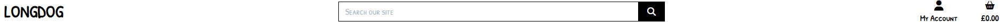
- ### Navigation Bar    
  I used Bootstrap to build my navigation bar, it collapses down on mobile screens and becomes a burger menu. The options available are HOME/ABOUT US/CLOTHING/HOMEWARE/FAQS. The navbar is fixed so it can be accessed easily from wherever the user is in the site.

  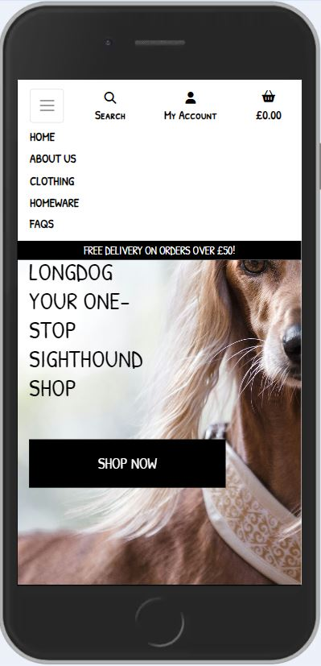    
  On desktop the user has the same options apart from Home as the Longdog logo at top left will return users to the home page

  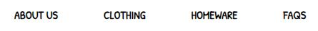    

  I chose to keep the search option available to non-registered users as I wanted first-time visitors to be able to explore the site and its products before committing to registering.
  Underneath the navbar is a banner advertising the free delivery threshold of £50. This banner could be easily changed by the site administrator to display special offers or any other information they wanted to convey.    


  - ### Home Page    
  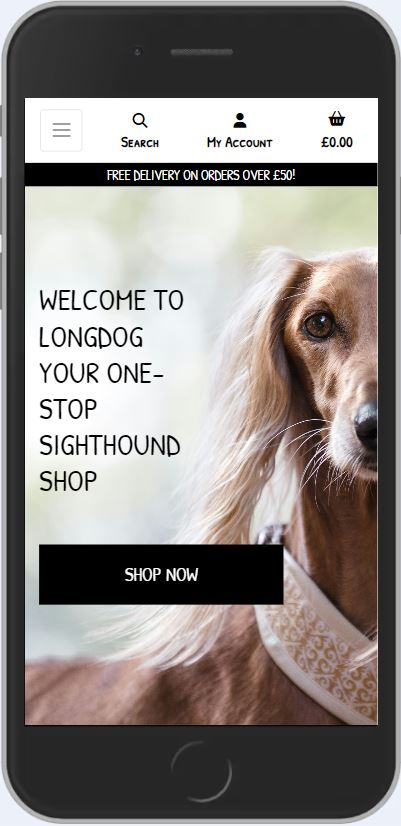    
  The home page is simple with just the hero image, a short introductory text panel and a call to action button. The home page is really just a taster and a means to direct the user to the areas of the site they are interested in. The hero image by <a href="https://unsplash.com/@sapegin?utm_content=creditCopyText&utm_medium=referral&utm_source=unsplash">Artem Sapegin</a> on <a href="https://unsplash.com/photos/short-coated-brown-dog-Ugg-EIfzy0c?utm_content=creditCopyText&utm_medium=referral&utm_source=unsplash">Unsplash</a> really grabs the users attention but also conveys the type of products that the site will be selling - elegant and stylish.
  The short text panel welcomes the user to Longdog but it is expected that as it is a sighthound specific site that the user will probably have been directed there by user recommendation or a site engine search so does not go into detail about the site.
  The prominent 'Shop Now' button is a call to action directing users to the Products page.


  - ### About Us Page    
  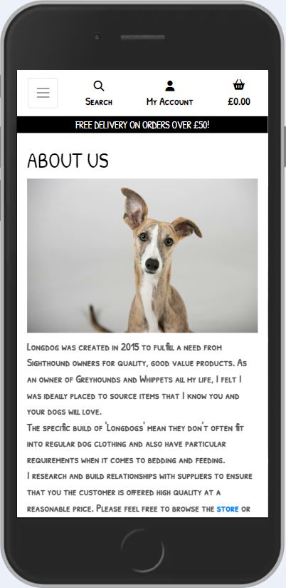  
  The About Us page is probably the first place that new visitors will navigate to. The page is split into two sections, on desktop the first section 'About Us' has an image and text box displayed side-by-side whereas on mobile these are stacked.

  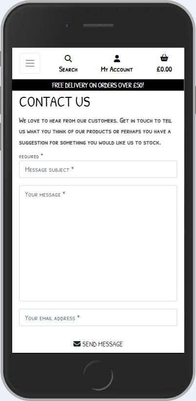      
  The second section 'Contact Us' contains a message form. There are input fields for Subject, message and email address which are all required fields. A non-registered user can send a message which I saw as a way to encourage new visitors to engage with the site owners and obtain information without commitment.
  The Contact Us form is also linked to from the FAQs page under the 'Contact Us' subject header.
  Once the user has submitted their message they will receive a confirmation pop-up message in the top right of the screen, this message can be dismissed by clicking the close icon. 

  - ### Products Page  
  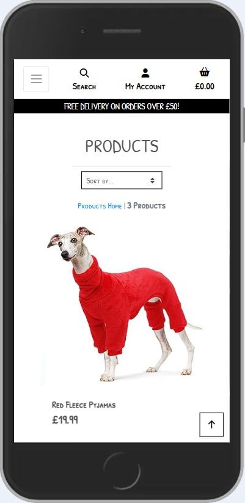    
  The user navigates to the products pages by selecting one of two categories CLOTHING or HOMEWARE. I chose these two as they encompass the range of products that I wanted to sell. Clothing is further broken down into Pyjamas & Housecoats, Outdoor Coats and Accessories. Homeware is further broken down into Beds, Feeding and Toys. It would be very easy to expand these categories in the future as the website grows.
  Once on the Products page you are presented with a 'sort box' dropdown which allows you to sort by Price or Name (ascending & descending). There is a counter that informs the user how many products are in the category selected.
  Each product has an image, name and price. I could have added more information but in order to keep the view manageable on mobiles I chose these three features. There is a 'back to top' arrow in the bottom right corner to enable the user to return quickly to the top without having to scroll.
  Once the user finds a product they are interested in they can click on the image and this will take them to the Product Detail page.

  - ### Product Detail Page  
  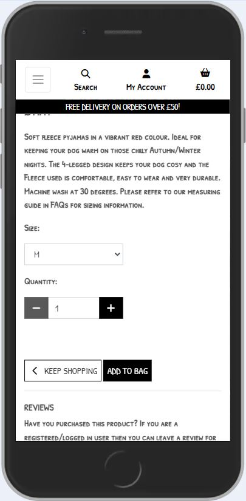      
  The product detail page provides more detail about the selected product. At present there is only one image per product but I would like to develop this in the future to display a carousel of images and the ability to zoom in on an image as I think this is expected from most users.
  Under the image there is the Product Name, Price and a Description. This description provides more information and in the case of products with sizes it directs users towards the measuring guide within the FAQs section. It would have been nice to make the measuring chart a modal that pops up when clicked but unfortunately I ran out of time.
  Next there is a Size dropdown box with the options S, M or L, again this could obviously be developed further to include a wider range if required.
  There is also a Quantity dropdown box for the user to select how many they would like to purchase. The range has been set from 1-99 as default.
  Underneath there are two button options 'Keep Shopping' which returns the user to the Products page so they can continue browsing or 'Add to Bag' which will display a pop-up success message confirming that the product has been added to the bag with a summary of the contents.
  Finally at the bottom of the page there is a Reviews section. This section allows all users to read posted reviews but also gives registered users the option to write a review.    
  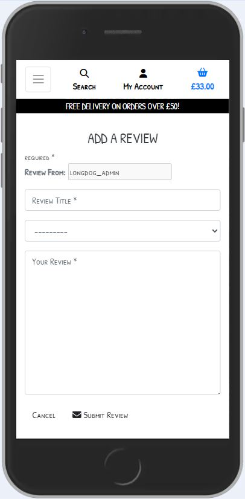     
  The form has input fields for User, Title and Review. There is also a dropdown from which the user can select the product they are reviewing. In the future I would like to pre-populate this with the product details as a dropdown would become very unwieldly. At the bottom of the form the user has the option to 'Cancel' or 'Submit' their review. The user can only edit/delete their own reviews not other users. At the moment the reviews are posted without being checked by the admin but this would obviously be a useful feature to implement. 

  - ### Shopping Bag Page    
  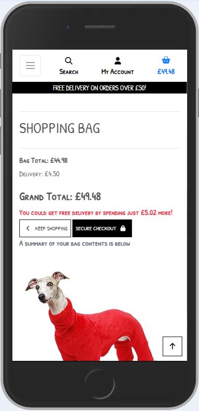  
  The Shopping Bag view details the contents of your bag before checking out. It displays the product image, name, size (if applicable) and price. Beneath each item there is the option to increase or decrease the quantities or remove the item completely. If any of these options are taken the bags grand total adjusts accordingly. There is also a really handy message displaying how much more you need to spend to obtain Free Delivery. This will obviously be an incentive to make an extra purchase to save on the delivery costs.
  Once the user is happy they can either 'Keep Shopping' or proceed to the 'Secure Checkout' via the buttons on screen.

  - ### Checkout Page    
  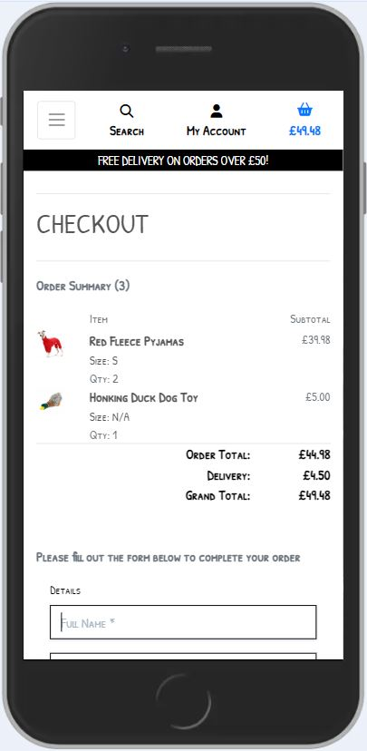  
  The Checkout page is split into four sections. The first details the order listing the individual items and giving a grand total. The next section is 'Details' containing a form field asking for Full Name and Email Address (both required fields). Following that there is a 'Delivery' section requiring the user to input Phone No., Address, Poscode and Country. There is then a prompt to encourage non-registered users to create an account or for registered users to login. The advantage of registering being you can keep track of past orders in the 'My Profile' section and also the delivery details will be saved for future purchases. Finally there is the 'Payment' section which asks for a 'Card number' and 'Expiry Date'. Once happy the user can 'Complete Order' or return and 'Adjust Bag'.
  On completion of checkout a confirmation pop-up will appear in the top right-hand corner to provide reassurance that the purchase was successful. The user will also receive an email confirmation of their order.    
  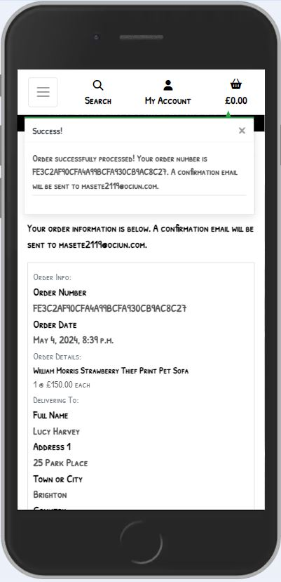

  - ### Profile Page    
  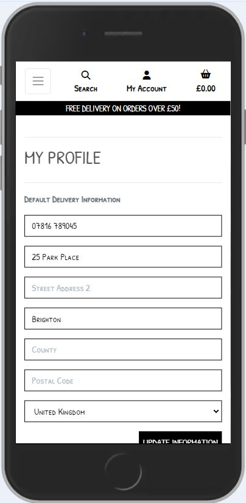  
  The registered user has the advantage of the Profile page where their past orders can be viewed. The Default Delivery Information is also stored here making subsequent checkouts quicker. The registered user has the option of updating their information here as well.
  There is a really nice amount of detail given on past orders with the order no., date, items and order total. You can also click on the order no. to access more detail such as delivery address and contact details. From the Profile page the user can access the dropdown menu under 'My Account' to Logout. the site admin will also see the added option of 'Site Management' from where products can be added or edited. 

  - ### FAQs Page    
  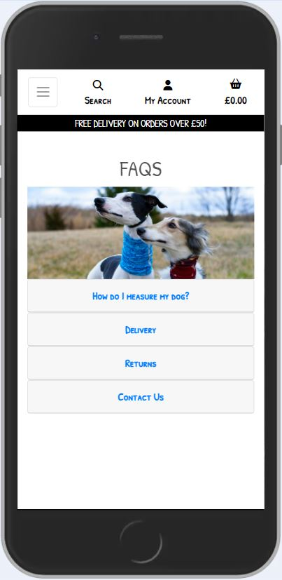    
  The FAQs page is where the user can visit to find out the most commonly asked questions. Currently I have questions on measuring your dog, delivery, returns and contact info. I would anticipate this page to be added to as the business develops.
  The top of the page contains a lovely image of two sighthounds by <a href="https://unsplash.com/@pupscruffs?utm_content=creditCopyText&utm_medium=referral&utm_source=unsplash">Katie Bernotsky</a> on <a href="https://unsplash.com/photos/white-and-black-short-coated-dog-YA2jb4V0JAU?utm_content=creditCopyText&utm_medium=referral&utm_source=unsplash">Unsplash</a>.
  I have used a Bootstrap component called Accordion to create the FAQs. This is a really nice feature that displays the header (the question) and once clicked drops down to reveal the content (the answer). This works particularly well on mobiles and fits with my mobile first design.

  - ### Sign Up Page    
      
  The sign up page is presented to users if they choose to register either by selecting 'Register' from the My Account dropdown or as part of the checkout process. They are reminded that if they already have an account they can simply 'Sign In' instead. The required fields are email, username and password. Notifications are set up to alert users they are already registered or the password they have selected is too short, too easy etc..
  I feel I have the right balance between features non-registered and registered users have access to. Guests can still make purchases which is the purpose of the site and message the site owner but registered users have the added features of being able to leave reviews and checkout quicker. This could be changed in the future if the site owner wanted new features to be restricted to registered users only.

  - ### CRUD    
  Within my site users have the ability to:
  * CREATE by adding reviews and sending messages 
  * READ by searching for products within the database
  * UPDATE by editing their orders and reviews
  * DELETE their orders and reviews

## Technologies Used
1. [Balsamiq:](https://balsamiq.com/)
   - Balsamiq was used to create the [wireframes](#wireframes) during the design process
1. [dbdiagram:](https://dbdiagram.io)
   - dbdiagram was used to create the [database schema](/documentation/database_schema.png) during the design process
1. [Django:](https://www.djangoproject.com/)
   - Django was used to create the Python web framework.
1. [Djecrety:](https://djecrety.ir/)
   - Djecrety was used to create the Secret Key.
1. [Bootstrap:](https://getbootstrap.com/)
   - Bootstrap was used to assist with the responsiveness and styling of the website.
1. [JQuery:](https://releases.jquery.com/)
   - jQuery was used in conjunction with Bootstrap to add interactivity.
1. [Hover.css:](https://ianlunn.github.io/Hover/)
   - Hover.css was used on the Social Media icons in the footer to add the float transition while being hovered over.
1. [Google Fonts:](https://fonts.google.com/)
   - Google fonts were used to import the 'Patrick Hand SC' font into the style.css file which is used for my text throughout.
1. [Font Awesome:](https://fontawesome.com/)
   - Font Awesome was used on all pages throughout the website to add icons for aesthetic and UX purposes.
1. [Favicon.io:](https://favicon.io/)
   - Favicon.io was used to create the icon on the web page tab.
1. [I Love IMG:](https://www.iloveimg.com/resize-image)
   - I Love IMG was used to crop and resize all images to enhance performance and increase Lighthouse scores during testing.
1. [Gitpod](https://gitpod.io)
   - Gitpod was used for version control by utilizing the Gitpod terminal to commit to Git and Push to GitHub.
1. [GitHub:](https://github.com/)
   - GitHub was used to store the projects code after being pushed from Git.
1. [AWS:](https://aws.amazon.com/)
   - AWS was used to store my statis and media images.
1. [ElephantSQL:](https://elephantsql.com/)
   - Elephant SQL was used as my PostgreSQL database.
1. [Heroku:](https://heroku.com/)
   - Heroku was used to deploy my project.
## Testing
Important part of your README!!!
### Google's Lighthouse Performance
Screenshots of certain pages and scores (mobile and desktop)
### Browser Compatibility
I have tested compatibility on the following browsers. Safari, Chrome, Edge and Firefox.
### Responsiveness
Responsive on all device sizes - This was checked using [Am I Responsive](https://ui.dev/amiresponsive) and by asking friends and family to test it on their devices. The devices checked included Samsung Galaxy, iPhone 8 and 10, iPad Air, Chromebook, Laptop and PC.
### Code Validation
Validate your code HTML, CSS, JS & Python - display screenshots
### Manual Testing user stories
Test all your user stories, you an create table 
User Story |  Test | Pass
--- | --- | :---:
paste here you user story | what is visible to the user and what action they should perform | &check;
- attach screenshot
### Manual Testing features
Test all your features, you can use the same approach 
| Status | feature
|:-------:|:--------|
| &check; | description
- attach screenshot
## Bugs
List of bugs and how did you fix them, you can create simple table
| Bug | Fix
|:-------:|:--------|
|   |    |
## Deployment
This website is deployed to Heroku from a GitHub repository, the following steps were taken:

#### Creating Repository on GitHub
- First make sure you are signed into [Github](https://github.com/) and go to the code institutes template, which can be found [here](https://github.com/Code-Institute-Org/gitpod-full-template).
- Then click on **use this template** and select **Create a new repository** from the drop-down. Enter the name for the repository and click **Create repository from template**.
- Once the repository was created, I clicked the green **gitpod** button to create a workspace in gitpod so that I could write the code for the site.
  
#### Making a Local Clone
1. Log in to GitHub and locate the [GitHub Repository](https://github.com/LHarveyDev/longdog)
2. Under the repository name, click "Clone or download".
3. To clone the repository using HTTPS, under "Clone with HTTPS", copy the link.
4. Open Git Bash
5. Change the current working directory to the location where you want the cloned directory to be made.
6. Type `git clone`, and then paste the URL you copied in Step 3.

```
$ git clone https://github.com/LHarveyDev/longdog
```

7. Press Enter. Your local clone will be created.

```
$ git clone https://github.com/LHarveyDev/longdog
> Cloning into `CI-Clone`...
> remote: Counting objects: 10, done.
> remote: Compressing objects: 100% (8/8), done.
> remove: Total 10 (delta 1), reused 10 (delta 1)
> Unpacking objects: 100% (10/10), done.
```

Click [Here](https://help.github.com/en/github/creating-cloning-and-archiving-repositories/cloning-a-repository#cloning-a-repository-to-github-desktop) to retrieve pictures for some of the buttons and more detailed explanations of the above process.

#### Forking the Github Repository 
By forking the GitHub Repository we make a copy of the original repository on our GitHub account to view and/or make changes without affecting the original repository by using the following steps...

1. Log in to GitHub and locate the [GitHub Repository](https://github.com/LHarveyDev/longdog.git)
2. At the top of the Repository (not top of page) just above the "Settings" Button on the menu, locate the "Fork" Button.
3. You should now have a copy of the original repository in your GitHub account.

#### Creating an app on Heroku
- After creating the repository on GitHub, head over to [heroku](https://www.heroku.com/) and sign in.
- On the home page, click **New** and **Create new app** from the drop down.
- Give the app a name(this must be unique) and select a **region** I chose **Europe** as I am in Europe, Then click **Create app**.

#### Deploying to Heroku.
- In GitPod CLI, the root directory of the project, run: pip3 freeze --local > requirements.txt to create a requirements.txt file containing project dependencies.
- In the Gitpod project workspace root directory, create a new file called Procfile, with capital 'P'. Open the Procfile. - Inside the file, check that web: gunicorn freedog.wsgi:application has been added when creating the file Save the file.
- Push the 2 new files to the GitHub repository
- Login to Heroku, select Create new app, add the name for your app and choose your closest region.
- Navigate to the Deploy tab on Heroku dashboard and select Github, search for your repository and click 'connect'.
- Navigate to the settings tab, click reveal config vars and input the following:


| Key | Value
|:-------:|:--------|
| DATABASE_URL  |    |
| IP  |    |
|  PORT |    |
|  SECRET_KEY   |     |

Actual Enviroment variables not disclosed for security
## Credits
### Code
- How to make card images the same size as each other [Stack Overflow](https://stackoverflow.com/questions/37287153/how-to-get-images-in-bootstraps-card-to-be-the-same-height-width)
- Resetting db in Django by Farheen Shahid[Scaler.com](https://www.scaler.com/topics/django/resetting-db-in-django/)
### Content
- Photo by <a href="https://unsplash.com/@sapegin?utm_content=creditCopyText&utm_medium=referral&utm_source=unsplash">Artem Sapegin</a> on <a href="https://unsplash.com/photos/short-coated-brown-dog-Ugg-EIfzy0c?utm_content=creditCopyText&utm_medium=referral&utm_source=unsplash">Unsplash</a>

Photo by <a href="https://unsplash.com/@sjung56?utm_content=creditCopyText&utm_medium=referral&utm_source=unsplash">S J</a> on <a href="https://unsplash.com/photos/a-brown-and-white-dog-sitting-on-top-of-a-white-floor-508khDxcc5I?utm_content=creditCopyText&utm_medium=referral&utm_source=unsplash">Unsplash</a>

Photo by <a href="https://unsplash.com/@pupscruffs?utm_content=creditCopyText&utm_medium=referral&utm_source=unsplash">Katie Bernotsky</a> on <a href="https://unsplash.com/photos/white-and-black-short-coated-dog-YA2jb4V0JAU?utm_content=creditCopyText&utm_medium=referral&utm_source=unsplash">Unsplash</a>
  
    
## Acknowledgments

- My Mentor Can Sucullu for continuous helpful feedback.
- Tutor support at Code Institute for their support.